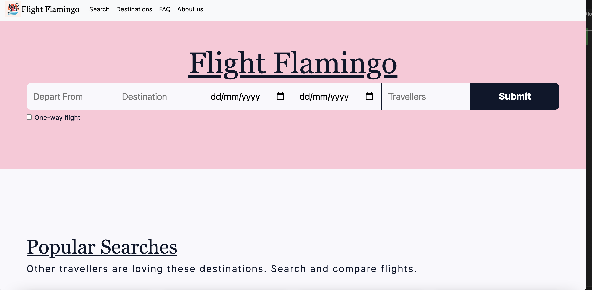
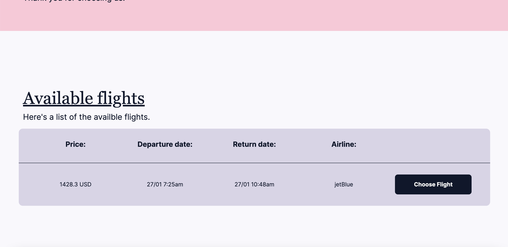

# Flight Flamingo

## Description

Flight Flamingo is a project made up by three developers. Eric Shen, Adrian Lamour and Curtis Bowen. Each person has had an important role to play in the development of this application.

We we're tasked to come up with an idea and of our own and build an application around that idea. Once we decided on an idea, we then moved onto naming our project. Since the idea we came up with was around travel and flights, Flight Flamingo sat well with us all.

The application allows a user to travel around the world. Booking a flight from one destination to another, with a return while having the options to include multiple people to the flight and what class they to choose to fly.

This was a our first project within the EdX bootcamp where we had set teams to work within. This has given us in insight to how the industry how working as part of a team.

## Table of Contents

Please follow the following links to navigate the Readme:

- [Installation](#installation)
- [Usage](#usage)
- [Credits](#credits)
- [License](#license)

## Installation

No installation is required, just boot up our website via the following [link](https://kidleis.github.io/flight-flamingo/)

## Usage

To use our website, please access it via the above link in the installation section. The page should look like the following:

Afterwards, enter the 3 letter IATA airport code for your start and end destination airports. For instance, London Heathrow Airport is LHR and New York John F Kennedy Airport is JFK.

Then, select the dates and open the modal to choose your optional selections (optional)

Afterwards press search, and voila! The results page should like this:

There are also some display content further down the page, such as popular travel destinations and an FAQ.

## Credits

This project was done as a group project by Eric Shen, Curtis Bowen and Adrian Lamour
- [Eric's Github](https://github.com/KidLeiS)
- [Curtis's Github](https://github.com/mvpcurtis)
- [Adrian's Github](https://github.com/add101)

We also used a variety of APIs, including
- [Flight API](https://www.flightapi.io/)
- [Giphy](https://developers.giphy.com/)
- [DayJS](https://day.js.org/en/)
- [JQuery UI](https://jqueryui.com/)
- [JQuery](https://jquery.com/)

We followed relevant documentation on those API websites.

## License

Our project is done on a GNU GPL v3 license. Please read the [license](LICENSE) to see what you can or cannot do with the work

## Future Development

We have a variety of work unfinished on the website. This include:
- Building a auto suggestion tool for the 3 letter IATA code
- Building a auto complete feature to automatically populate or search for trips based off popular destination selected
- And many more...

If you would like to contribute, please get in touch!

